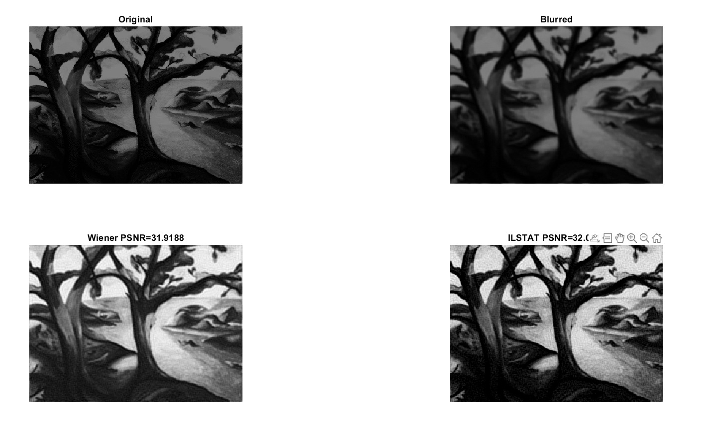
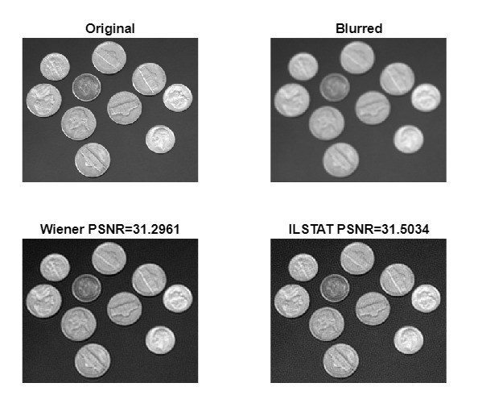
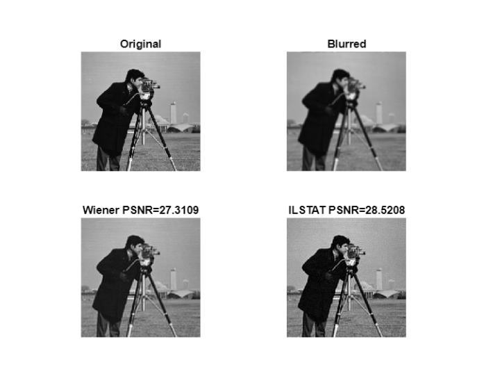

# C13_MFC4_Compressed_Sensing_Reconstruction_ADMM  

---

# Project Title
## Compressed Sensing Reconstruction using ADMM 

---

## Member Details

## Team C-13

- **Jignesh Sudheer**  
  Roll No: CB.SC.U4AIE24222  
  Email: <cb.sc.u4aie24222@cb.students.amrita.edu>

- **Bhadhresh R P**  
  Roll No: CB.SC.U4AIE24208  
  Email: <cb.sc.u4aie24208@cb.students.amrita.edu>

- **Shravan Rajesh Menon**  
  Roll No: CB.SC.U4AIE24253  
  Email: <cb.sc.u4aie24253@cb.students.amrita.edu>

- **Gautham T**  
  Roll No: CB.SC.U4AIE24264  
  Email: <cb.sc.u4aie24264@cb.students.amrita.edu>

---

## Introduction

In imaging systems, the captured image is often degraded by blur and noise during acquisition.

The degradation model can be written as

$$
b = Ax + n
$$

where

- $x$ : original image  
- $A$ : blur operator  
- $b$ : observed blurred image  
- $n$ : noise.

Recovering the original image from blurred observations is an ill-posed inverse problem.

Compressed sensing provides a framework for recovering signals from incomplete measurements by exploiting sparsity.  
We formulate the image deblurring problem as a sparse reconstruction task and solve it using the 

## Objective

The objective of this project is to study and implement a compressed sensing reconstruction algorithm using the Alternating Direction Method of Multipliers (ADMM) combined with Limited Shrinkage Thresholding (LST) for recovering sparse signals from underdetermined linear measurements.

---

## Motivation / Why the Project is Interesting

Compressed sensing allows signal reconstruction using fewer measurements by exploiting sparsity. This is important in applications where acquiring measurements is expensive or limited. The project is interesting because it combines optimization techniques with sparsity-promoting thresholding methods to solve an ill-posed reconstruction problem.

---

## Connection Between Compressed Sensing and Image Deblurring

The general compressed sensing reconstruction problem is formulated as

$$
\min_x \lVert Ax - b\rVert^2 + \lambda \lVert x\rVert _0
$$

where

- $x$ is the sparse signal to be recovered  
- $A$ is the measurement operator  
- $b$ is the observed measurement vector  

In the context of image deblurring, the blur operator acts as the measurement operator.  
The degradation model of a blurred image is

$$
b = Ax + n
$$

where

- $x$ is the original sharp image  
- $A$ is the blur operator (convolution kernel)  
- $b$ is the observed blurred image  
- $n$ represents noise.

Recovering the original image from blurred observations can therefore be formulated as a compressed sensing reconstruction problem.  
The ILSTAT-ADMM algorithm is used to solve this optimization problem while enforcing sparsity using Limited Shrinkage Thresholding (LST).

---

## Gaussian Blur and Convolution

In image deblurring, blur is modeled as a convolution between the original image and a blur kernel.

$$
b = h * x
$$

where

- $x$ is the original image  
- $h$ is the blur kernel  
- $b$ is the blurred image.

In this project, a **Gaussian kernel** is used to simulate blur.

The Gaussian function is

$$
h(x,y) =
\frac{1}{2\pi\sigma^2}
e^{-\frac{x^2+y^2}{2\sigma^2}}
$$

Each pixel in the blurred image becomes a weighted average of neighboring pixels, which spreads intensity and removes high-frequency details.

This blur operation corresponds to the linear operator $A$ in the model

$$
b = Ax + n
$$

---

## Difference Between Blur and Noise

| Property | Blur | Noise |
|---------|------|------|
| Cause | Imperfect imaging system, motion, defocus | Random disturbances during image acquisition |
| Mathematical Model | Convolution with blur kernel | Additive random signal |
| Equation | $b = Ax$ | $b = Ax + n$ |
| Effect on Image | Smooth edges and remove high-frequency details | Random pixel fluctuations |
| Appearance | Smooth or out-of-focus image | Grainy image |
| Example Types | Gaussian blur, motion blur, defocus blur | Gaussian noise, salt & pepper noise, Poisson noise |

---

## Compressed Sensing Formulation

Compressed sensing exploits sparsity to recover signals from fewer measurements.

The reconstruction problem is written as

$$
\min_x \lVert Ax - b\rVert^2 + \lambda \lVert x\rVert _0
$$

The first term ensures data consistency while the second term enforces sparsity.

---

## Methodology

### Mathematical Techniques Used

- Sparse signal modeling
- ℓ₀-norm based sparsity concept
- Limited Shrinkage Thresholding (LST)
- Alternating Direction Method of Multipliers (ADMM)
- Gradient-based iterative updates

---

### ADMM Formulation
### x-Update Derivation (ILSTAT-ADMM)

#### 1. Optimization Problem

The image reconstruction problem is formulated as

$$
\min_x \lVert Ax - b\rVert^2 + \lambda \lVert x\rVert _0
$$

where

- $x$ – original image  
- $A$ – blur operator  
- $b$ – observed blurred image  
- $\lambda$ – sparsity regularization parameter  

The first term enforces **data fidelity**, while the second promotes **sparsity**.

#### 2. Variable Splitting

Introduce an auxiliary variable

$$
y = Ax
$$

The optimization becomes

$$
\min_{x,y} \frac{1}{2} \lVert y - b\rVert^2 + \lambda \lVert x\rVert _0
$$

subject to

$$
y = Ax
$$

This separates

- the **data fidelity term** (depends on $y$)
- the **sparsity term** (depends on $x$).

#### 3. Augmented Lagrangian

To enforce the constraint $y = Ax$, the augmented Lagrangian is constructed:

$$
L(x,y,z) =
\frac{1}{2} \lVert y - b\rVert^2
+
\lambda \lVert x\rVert _0
+
z^T (Ax - y)
+
\frac{\rho}{2} \lVert Ax - y\rVert^2
$$

where

- $z$ is the Lagrange multiplier  
- $\rho$ is the penalty parameter.

---

#### 4. x-Update Subproblem

In ADMM, the $x$ update is obtained by minimizing the Lagrangian while fixing $y^k$ and $z^k$:

$$
x^{k+1} = \arg\min_x L(x, y^k, z^k)
$$

Substituting the Lagrangian gives

$$
\min_x
\left(
\lambda \lVert x\rVert _0
+
z^{kT}(Ax - y^k)
+
\frac{\rho}{2} \lVert Ax - y^k\rVert^2
\right)
$$

The term $\frac{1}{2}\lVert y-b\rVert^2$ is removed since it does not depend on $x$.

### 5. Combining the Linear and Quadratic Terms

Now consider the terms

$$
z^{kT}(Ax - y^k) + \frac{\rho}{2} \lVert Ax - y^k \rVert^2
$$

Let

$$
u = Ax - y^k
$$

Then the expression becomes

$$
z^{kT}u + \frac{\rho}{2}u^Tu
$$

Factor $\frac{\rho}{2}$:

$$
\frac{\rho}{2}\left(u^Tu + \frac{2}{\rho}z^{kT}u\right)
$$

Using the identity

$$
\lVert u + a\rVert^2 = u^Tu + 2a^Tu + a^Ta
$$

choose

$$
a = \frac{z^k}{\rho}
$$

so that

$$
u^Tu + \frac{2}{\rho}z^{kT}u =
\lVert u + \frac{z^k}{\rho} \rVert^2 -
\lVert \frac{z^k}{\rho} \rVert^2
$$

#### Multiply Back by $\frac{\rho}{2}$

We obtained

$$
\frac{\rho}{2}\left(u^Tu + \frac{2}{\rho}z^{kT}u\right)
$$

Substituting the completed square expression

$$
u^Tu + \frac{2}{\rho}z^{kT}u = \lVert u + \frac{z^k}{\rho} \rVert^2 - \lVert \frac{z^k}{\rho}\rVert^2
$$

gives

$$
\frac{\rho}{2}
\left(
\lVert u+\frac{z^k}{\rho}\rVert ^2 -
\lVert \frac{z^k}{\rho}\rVert^2
\right)
$$

---

#### Separate the Terms

Expanding the expression gives

$$
\frac{\rho}{2}\lVert u + \frac{z^k}{\rho}\rVert^2 - \frac{\rho}{2}\lVert\frac{z^k}{\rho}\rVert^2
$$

The second term does **not depend on $x$**, so it is constant.

In optimization, constants do not affect the minimization, so this term can be ignored.

---

#### Final Simplified Form

Thus we keep only

$$
\frac{\rho}{2}\lVert u + \frac{z^k}{\rho}\rVert^2
$$

Now substitute

$$
u = Ax - y^k
$$

Then

$$
u + \frac{z^k}{\rho} = Ax - y^k + \frac{z^k}{\rho}
$$

Rewrite this as

$$
Ax - \left(y^k - \frac{z^k}{\rho}\right)
$$

Define

$$
b_k = y^k - \frac{z^k}{\rho}
$$

Therefore the expression becomes

$$
\frac{\rho}{2}\lVert Ax - b_k\rVert^2
$$

Thus

$$
\begin{aligned}
z^{kT}(Ax - y^k) + \frac{\rho}{2}\lVert Ax - y^k\rVert^2
&= \frac{\rho}{2}\lVert Ax - b_k\rVert^2
\end{aligned}
$$

---

### 6. Simplified x-Subproblem

The x-update becomes

$$
x^{k+1} =
\arg\min_x
\left(
\frac{\rho}{2}\lVert Ax - b_k\rVert^2 + \lambda \lVert x\rVert _0
\right)
$$

This is a **sparse least-squares problem**.

---

### 7. Gradient of the Quadratic Term

Consider

$$
f(x) = \lVert Ax - b_k\rVert^2
$$

The gradient is

$$
\nabla f(x) = A^T(Ax - b_k)
$$

because the derivative of $Ax$ with respect to $x$ produces $A^T$.

---

### 8. Gradient Descent Update

Using gradient descent,

$$
x_{\text{temp}} =
x_k - \frac{1}{v} A^T(Ax_k - b_k)
$$

where

- $x_k$ is the estimate at iteration $k$
- $v$ controls the step size.

---

### 9. Enforcing Sparsity

The sparsity term $\lambda \lVert x\rVert _0$ is handled using a shrinkage operator:

$$
x_{k+1} = \text{shrink}(x_{\text{temp}})
$$

This step removes small coefficients and preserves significant ones.

### 10. Final x-Update

$$
x_{k+1} =
\text{shrink}
\left(
x_k - \frac{1}{v} A^T (Ax_k - b_k)
\right)
$$

---

### y-Update Derivation

In ADMM, the $y$-update is obtained by minimizing the augmented Lagrangian while keeping $x^{k+1}$ and $z^k$ fixed:

$$
y^{k+1} = \arg\min_y L(x^{k+1},y,z^k)
$$

From the augmented Lagrangian

$$
L(x,y,z) =
\frac{1}{2}\lVert y-b\rVert^2 + \lambda \lVert x\rVert _0 + z^T(Ax-y) + \frac{\rho}{2}\lVert Ax-y\rVert^2
$$

the term $\lambda \lVert x \rVert _0$ does not depend on $y$, so it can be ignored.

Thus the $y$-subproblem becomes

$$
\min_y
\left(
\frac12 \lVert y-b\rVert^2
+
z^{kT}(Ax^{k+1}-y)
+
\frac{\rho}{2}\lVert Ax^{k+1}-y\rVert^2
\right)
$$

---

### Taking the Gradient

Derivative of each term with respect to $y$:

$$
\nabla_y \left(\frac{1}{2}\lVert y-b\rVert^2\right) = y-b
$$

$$
\nabla_y \left(z^{kT}(Ax^{k+1}-y)\right) = -z^k
$$

$$
\nabla_y \left(\frac{\rho}{2}\lVert Ax^{k+1}-y\rVert^2\right) = -\rho(Ax^{k+1}-y)
$$

---

### Set Gradient to Zero

$$
(y-b) - z^k - \rho(Ax^{k+1}-y) = 0
$$

### Rearranging Terms

$$
y - b - z^k - \rho Ax^{k+1} + \rho y = 0
$$

Group the $y$ terms:

$$
(1+\rho)y = b + z^k + \rho Ax^{k+1}
$$

---

### Final y-Update

$$
y^{k+1} =
\frac{b + z^k + \rho Ax^{k+1}}{1+\rho}
$$

---

### z-Update Derivation

After computing $x^{k+1}$ and $y^{k+1}$, the multiplier is updated.

#### Constraint Residual

The equality constraint is

$$
y = Ax
$$

The constraint violation (primal residual) is

$$
r^{k+1} = y^{k+1} - Ax^{k+1}
$$

This measures how much the constraint is violated.

#### Dual Ascent Rule

ADMM updates the multiplier using dual ascent:

$$
z^{k+1} = z^k + \rho r^{k+1}
$$

#### Substitute Residual

Substitute

$$
r^{k+1} = y^{k+1} - Ax^{k+1}
$$

so the update becomes

$$
z^{k+1} = z^k + \rho (y^{k+1} - Ax^{k+1})
$$

#### Final z-Update

$$
z^{k+1} = z^k + \rho (y^{k+1} - Ax^{k+1})
$$

This is the multiplier update used in the **ILSTAT-ADMM algorithm**.

### Demonstration Using a Toy Example

A synthetic sparse signal with a small number of non-zero elements is generated. Random linear measurements are obtained using a sensing matrix. The ADMM-based algorithm with LST is applied iteratively to reconstruct the sparse signal. The reconstructed signal is compared with the original signal to verify recovery performance.

---

## Results & Discussion

## Evaluation Metrics

Reconstruction quality is evaluated using Peak Signal-to-Noise Ratio (PSNR).

First compute Mean Squared Error:

$$
MSE = \frac{1}{N}\sum (x - x_{rec})^2
$$

Then

$$
PSNR = 10\log_{10}\frac{MAX^2}{MSE}
$$

Higher PSNR indicates better reconstruction quality.

- Successful reconstruction of sparse signals from limited measurements is observed.
- The reconstructed signal closely matches the original sparse signal.
- Convergence behavior shows a decreasing reconstruction error with iterations.
- Sensitivity of the reconstruction to the LST threshold parameter (λ) is analyzed, showing that proper parameter selection is important.
- The observed results are consistent with the expected behavior discussed in the base paper.

## Tree Image Reconstruction

## Coins Image Reconstruction

## Cameraman Image Reconstruction

---

## Computational Performance

- Platform : Laptop
- Hardware : cpu
- time taken for execution : 65.96 seconds
- Programming language : Matlab

## Future Plans

- Apply the proposed compressed sensing reconstruction algorithm to medical imaging problems such as MRI, where fast image acquisition and reduced sampling are critical.

---

## References

[1] Y.-M. Li and H. Wang,  
“A New Limited Shrinkage Thresholding Iterative ADMM Algorithm for Compressed Sensing Signal Reconstruction,”  
Signal Processing, Elsevier, 2026.  
https://doi.org/10.1016/j.sigpro.2025.110319

---

## Repository Structure

- `code` : MATLAB implementation of the ADMM + LST algorithm  
- `doc` : Base paper, review pdf, figure 
- `README.md` : Project documentation

